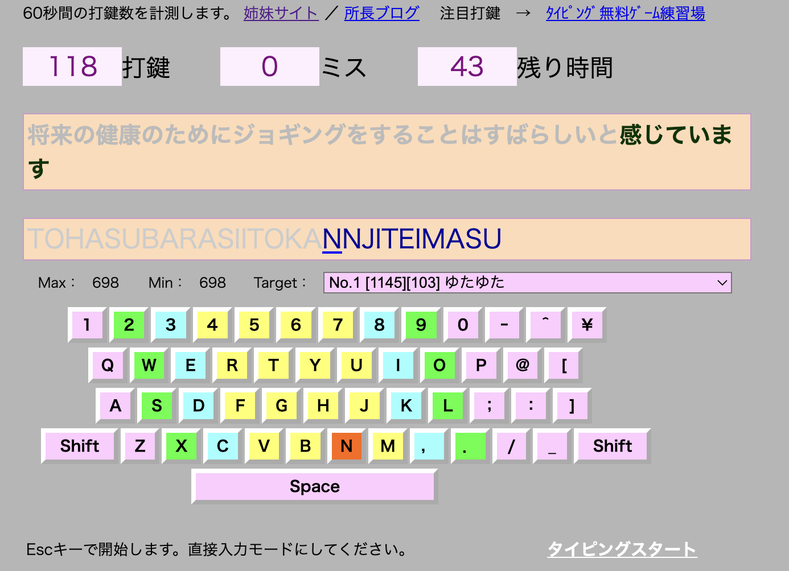
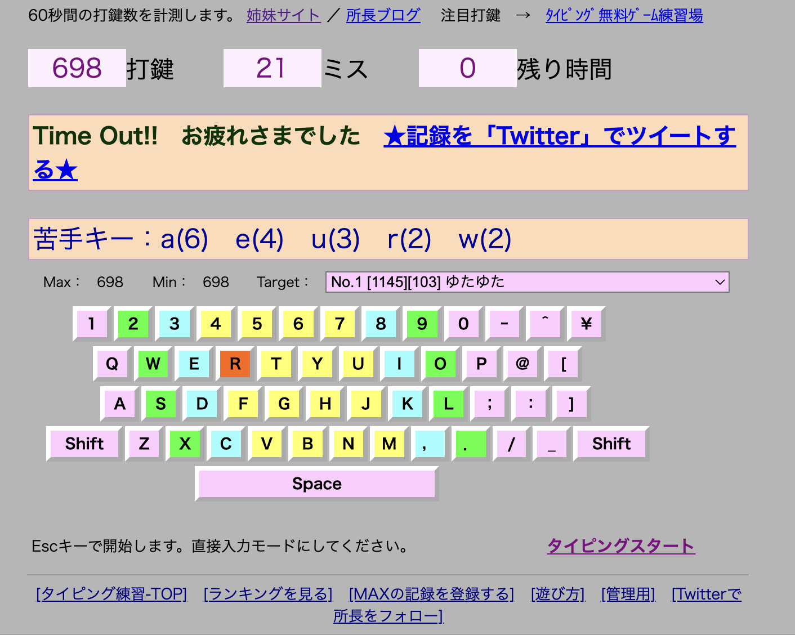
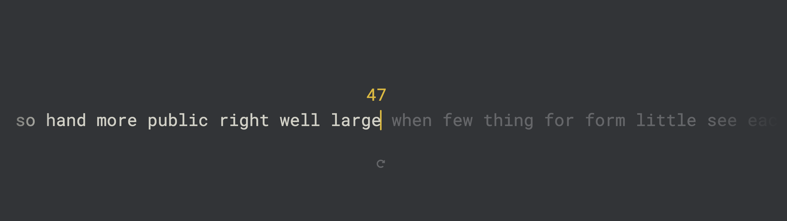
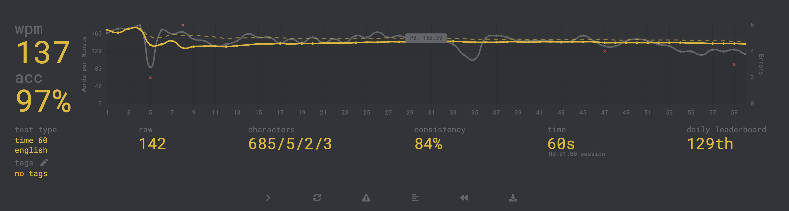

# 仕様

## アプリケーションでできること

- 打鍵トレーナーで出題される文章に含まれる単語を練習できる
  - [打鍵トレーナーの仕様](./datore-specification.md)
- プレイする時間を設定できる。MonkeyTypeと同様に、15秒、30秒、60秒、120秒から選択する。
- 打鍵トレーナーと同様に、ローマ字入力の複数の打ち方で入力できる。
  - こちらのライブラリ[Boson328/higgsino: タイピングソフト制作を簡単に](https://github.com/Boson328/higgsino)は、ほとんど全てのパターンが網羅されているはず。
- 入力すると、Monkeytypeの文字が流れていくモードのような感じで、文字が流れていく。
- プレイが終了すると、その結果を数値とグラフで確認できる。
- 単語をフィルタリングできる。
  - 具体的には、[打鍵トレーナーの仕様](./datore-specification.md)で、単語を「漢字」「カタカナ」「ひらがな」に分類しているが、全て or 3つのいずれかを選択できる。
  - それに加えて、ローマ字またはひらがなで絞り込むことができる。具体的には「oku」「ょう」「い」などで検索する。

追加したい昨日はいろいろあるが、ひとまずは上記の機能を実装する。練習アプリとして使える最低限の機能を実装した、シンプルなアプリケーションを作る。

## 参考

打鍵トレーナーのプレイ画面:

打鍵トレーナーの結果画面:

monkeytypeのプレイ画面:

monkeytypeのリザルト画面:

## ローマ字入力の複数の入力パターンについて

- 「しゃ」はsya/sha/shilya/shixyaのいずれでも入力可能。
- 「う」はu/wu/whuのいずれでも入力可能。
- 「い」はi/yiのいずれでも入力可能。

その他いろいろあって、打鍵トレーナーで対応しているものは全て対応する。実装方法は悩み中。
