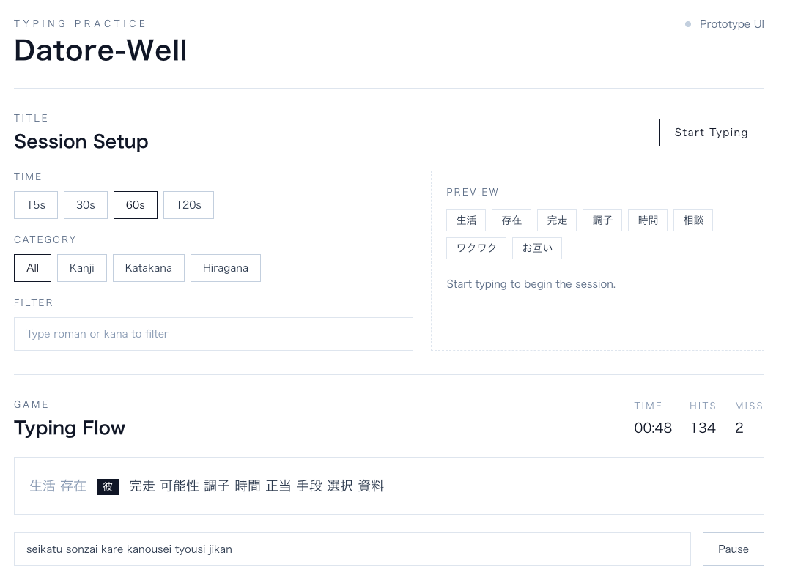
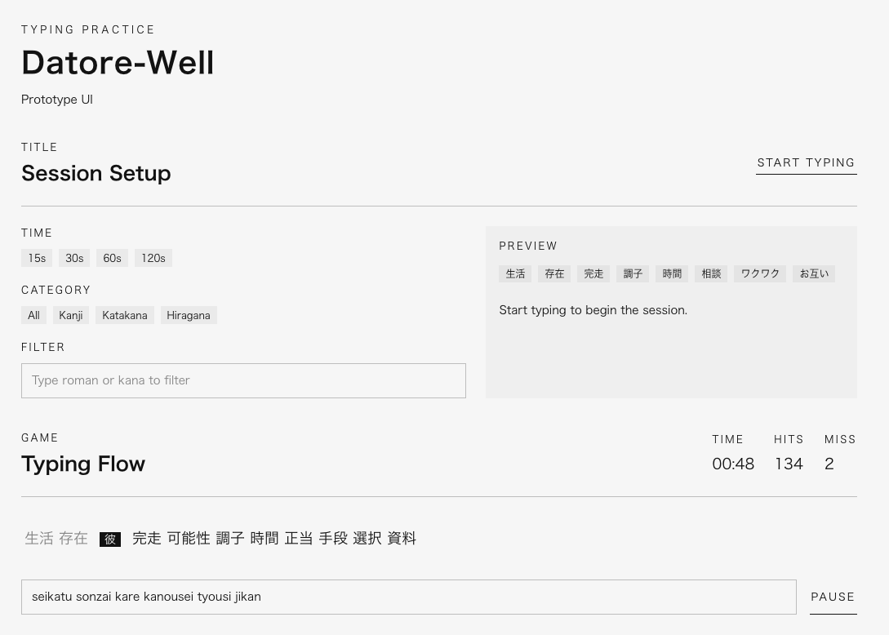

# タスク一覧

## 目的
- 実装を進めるための最小タスク群を管理する
- 仕様・設計の更新に合わせて見直す

## ステータス

### Todo

- 仕上げ
  - READMEの遊び方と起動手順を更新する
- UI実装（Rabbit-TEA）
  - 結果画面にグラフ表示を追加する
- 文末のnは、n一回でOKにする
  - ライブラリの側にオプションを追加する必要があるかも
- `se`より`ce`、`ka`より`ca`が優先されているので、直す
  - 打鍵トレーナーと同じような選択オプションを実装することも考慮しておいた方が良さそう

### In Progress

- カテゴリー選択でフィルタリングできるようにする
  - TopModelとTypingModelに`filtered_words`を追加して、表示とロジックに使用する
  - Deckは、単語をシャッフルしてn(今の実装はn = 10?)個追加する、みたいな感じでOK
- フィルター入力でフィルタリングできるようにする
  - ローマ字での検索の実装は複雑なので、まずはかなでの検索を実装する
  - WordItemにkanaフィールドを追加する必要がありそう
- ミスした文字が分かるようにする
  - ミスしたら、次の文字を赤色で表示する
  - ↑これだとスペースがわかりにくいので、スペースをミスした場合は赤下線を表示する

### Done

- リファクタリング
  - [x] ViewとMsgはそのままで、ModelとUpdateをちゃんとすれば良さそう
  - [x] まずはModelを画面ごとに分割する
  - [x] キーボード入力の受け取り方を考えよう
- 全ての単語を打てるようにする
  - [x] ライブラリを公開したので、それを使うように修正する(typinglabs/romaji_typing)
  - [x] 漢字のワードにアノテーションをつける
  - [x] 漢字を含んでいるワードも打てるように、コードを修正する
- 仕様・設計の更新
  - Rabbit-TEA採用をdocs/design.mdに反映する
  - 機能要件の最新版をdocs/specification.mdに整理する
  - 画面構成と状態遷移（タイトル/ゲーム/結果）を決める
- Rabbit-TEA学習・検証
  - Rabbit-TEAの環境構築（moon/bun/vite/tailwindの整備）を行う
  - 最小サンプル（カウンタ＋キー入力）を作成する
  - 画面描画、状態更新、イベント処理の流れを整理する
- コアゲームロジック
  - 入力判定（正誤、部分一致、確定）を実装する
  - 問題文/単語の取得・シャッフル・出題順ロジックを実装する
  - スコア計算（正確率、WPM/CPM、ミス数）を定義・実装する
  - タイマー（制限時間/経過時間）を実装する
- UI実装（HTML + Tailwind）
  - タイトル画面のUIを作成する
  - ゲーム画面のUIを作成する
  - 結果画面のUIを作成する
  - タイピング表示のモックを作成・検証する
- UI実装（Rabbit-TEA）
  - タイトル画面を実装する
  - ゲーム画面を実装する（問題文、入力、進捗、スコア）
  - 結果画面を実装する（成績、リトライ導線）
  - 画面遷移と状態管理を接続する
  - タイピング画面の入力受付（クリックで開始/受付中表示/キー入力）を実装する
  - タイピング表示の基準位置を中央固定で揃える
  - タイピング表示の幅をヘッダー基準に揃える
  - トップ/プレイの表示語数を揃える
  - カーソル周辺の余白とスペース表示を調整する
  - ひらがなの単語間スペースを調整する
  - タイマー更新とタイムアップ時の遷移を実装する
- UI改善（トップ画面）
  - 左上にアプリ名を表示し、クリックでトップへ戻れるようにする
  - メニューを日本語化する
  - Start Typing 説明文を削除する
  - STARTボタンを下に配置する
  - トップページにタイピングエリアを先に表示する
  - タイピング入力でゲーム開始に遷移する
  - 設定のクリック要素にポインターカーソルを付与する
  - タイピング開始で設定をフェードアウトする
- UI改善
  - ヘッダーのフォントサイズを大きくする
- UI改善（結果画面）
  - 打鍵数/ミス数/KPM/正確率の4項目に整理し、他の要素とのデザインを整える
  - リトライ導線を削除して、トップへ戻るのみにする
- バグ修正
  - タイピング画面の入力済みローマ字が実際の入力値を表示するようにする
  - スペース入力を1打鍵としてカウントする

### 改善点

- 左上にアプリケーション名（「打トレ単語練習」にしようかな）を入れて、クリックで飛べるようにする
  - 既存の「TITLE」「Session Setup」などは不要
- メニューを日本語化する
  - TIME→時間、15s→15秒、CATEGORY→カテゴリー、ALL→全て、Kanji→漢字、etc...
- Start typing to begin the sessionはここでは不要
- 「START TYPING」が左上にあるのが押しにくいので、下に持ってくる
- トップページの中央に、タイピングエリアを最初から載せておく
- タイピングを開始したタイミングで、ゲームをスタートし、同時に設定はフェードアウトする
- 設定のクリックするところは、カーソルがポインターになるようにする

コードはぐちゃぐちゃになりかけていますが、とりあえず機能ができるまでは耐えられそうなので我慢します。

## 主要マイルストーン（任意）
- MVP: docs/specification.md の「アプリケーションでできること」6つが全て動作する
- v0.1: 
- v1.0: 

## メモ

キーボード入力はどうやって受け取ればいいのか。

MonkeyTypeのように、入力欄をクリックして、入力を開始したらスタートしたい。

入力欄の表示について。

Monkey Typeと違って、漢字混じり文とローマ字の両方を表示する必要があるから、位置をどこで揃えるか確認する。

とりあえず、ややこしいのでひらがなで考える。例えば、単語が「したい　ことに」のとき、入力に応じて次のように変化する。

|は基準位置（画面の中央）を表す。|の左が入力済みで、|の右がこれから入力する文字。ローマ字の方はガイドを表示する。

            |したい　ことに
            |sitai kotoni

            |したい　ことに
           s|itai kotoni

          し|たい　ことに
          si|tai kotoni

          し|たい　ことに
         sit|ai kotoni

        した|い　ことに
        sita|i kotoni

      したい|　ことに
       sitai| kotoni

    したい　|ことに
      sitai |kotoni

    したい　|ことに
     sitai k|otoni

  したい　こ|とに
    sitai ko|toni

  したい　こ|とに
   sitai kot|oni

漢字とローマ字で幅が違うのはどうすればいいんだろう？

---

UIモックで分かったこと
- |カーソルは文字ではなく細い縦線で描画するとズレが少ない
- クリックで受付開始し、受付中だけカーソル表示するUXが良い
- 入力欄は別divではなく、ワード表示領域をクリック可能にする
- 左側は「外側でクリップ + 内側を右端固定」で末尾を中央に寄せると安定する

---

表示ロジックの課題と整理（2026-02-04）
- 中央固定カーソルで左右を流す場合、CSSだけで「左側の末尾を中央に寄せて自然にクリップ」は不安定になりやすい
- 最終的に「外側でクリップ + 内側を右端固定（absoluteではなくflex-end）」で解決できた
- 文字数で切る方法は違和感が強い（途中で切れるため）
 - JSで測る案は不要になった（CSS解決）

---

画面はRabbit-TEAに移植できたので、インタラクションと、それに付随する処理をどう実装していくか。

- トップページ
  - 秒数を選択する
  - カテゴリーを選択する
  - フィルターを入力する
  - 入力でタイピングを開始する
- タイピング画面
  - タイマーに応じて時間を更新する
  - キーボード入力に応じて、打鍵数とミス数を更新する
  - 時間が0になったら、結果画面に移動する
- 結果画面
  - リザルトデータを計算して、表示する
  - グラフを表示する（TODO）
  - リトライを押したら、設定はそのままで、トップページに戻る

---

- 単語を複数表示するため、残り何個になったら不足分を補充するかの設計が必要。
- デザインについて
  - なるべくシンプルにすることを依頼
  - カード型UIや、影はAIっぽいので避ける
  - フォントは見やすいゴシック体にする

クリーム色で目に優しい感じになった。これで進めていこうかな。

