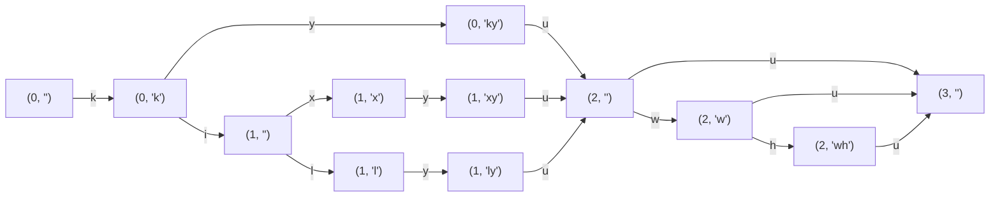

# ローマ字入力の判定について

[Boson328/higgsino: タイピングソフト制作を簡単に](https://github.com/Boson328/higgsino)を参考にして実装します。

## インターフェイスについて

状態はイミュータブルに扱う（状態更新で新しい状態を返す）。

ローマ字タイピングで必要なのは

`(状態, 入力したキー) -> (状態, 結果)`

となるような関数です。状態として必要なのは、

- 今まで打ったローマ字（正解したもののみ）
- ローマ字の残り
- 入力済みのかな
- 未入力のかな

あたりがあればOKです。例えば、`こんにちは`というワードを打つ場合は

- 今まで打ったローマ字: konnnit
- ローマ字の残り: iha
- 入力済みのかな: こんに
- 未入力のかな: ちは

です。これらのデータがあれば、ローマ字タイピングゲームで必要なデータが揃います。

他には、`結果`は正解したかどうか、ワードを打ち終わったかどうかなどがあれば便利です。

入力したキーが正解したかどうかは、今まで打ったローマ字の長さが増えたかどうかでわかりますが、返した方がいいでしょう。

ワードを打ち終わったかどうかは、未入力のかなが空文字かどうかで分かるので、なくても良いです。

## Moonbitでの実装について

### インターフェイス（案）

```mbt
struct RomanState {
  typed_roman : String      // 正解済みローマ字
  remaining_roman : String  // 残りローマ字
  typed_kana : String       // 入力済みのかな
  remaining_kana : String   // 未入力のかな
}

enum RomanResult {
  CorrectKey
  WrongKey
  WordCompleted
}

fn init_kana(kana : String) -> RomanState
fn apply_key(state : RomanState, key : Char) -> (RomanState, RomanResult)
```

## 実装方針

- https://github.com/Boson328/higgsino
- https://github.com/WhiteFox-Lugh/RomanTypeParser

どちらもほとんど全ての入力パターンに対応しているはず。higgsinoは以前タイピングゲーム制作に使ったことがあり、問題なく使用できた。

- https://github.com/tekihei2317/react-playground/blob/main/typing-input-check/src/checker.ts

これは自前で書いた、Google日本語入力のローマ字テーブルを使って実装したもの。ローマ字だけに対応するのであれば、もっと簡易的に書けるはず。

{ buffer, key } -> { buffer, state, result }

state = { typed_roman, remaining_roman, typed_kana, remaining_kana }

result = Corect | Wrong | Completed

上の関数を書けば、ひらがなからローマ字への変換は最短経路の問題にできる（幅優先探索で、最も短いローマ字に変換する）。

まぁ置換するだけでもできるんだけど。

正誤判定についてはどうだろうか、これ以降で正解することはない、という判定をする必要がある。

例えば、「にゃ」の箇所で「n」と打ったら、「nya」があるのでまだ大丈夫。「ni」はOK、「nu」はダメ、「ny」もOK。

「んか」で「n」の場合はOK、「nk」もOK。「nt」はダメ。これもなんとかならないだろうか。

## グラフを使った正誤判定アルゴリズム

ひらがなの文字列に対し、それを打つための有効な打ち方をグラフで表現します。

頂点の状態は、`(ひらがなの現在のインデックス, ひらがなに未変換のバッファ)`です。

「きゅう」を例にして考えてみます。有効な打ち方には、`kyuu`、`kixyuu`、`kilyuu`、`kyuwu`、`kyuwhu`、`kixyuwhu`などがあります。

例えば、kyuuと打った場合には`(0, "") -k-> (0, "k") -y-> (0, "ky") -u-> (2, "") -u-> (3, "")`と遷移します。

グラフにすると、以下の通りです。



正誤判定のアルゴリズムは、次のように行います。

- まず、上記のグラフを作成する
- 逆向きに辺を張ったグラフを作成して、ゴールから各頂点への最短距離を求める
- スタートからゴールまでの最短経路Rを計算して、保持しておく
  - この例の場合は、R = "kyuu"（実際は文字列で持つわけではないが、説明のため）
- 正誤判定は、入力したキーに対応する辺がグラフにあるかを確認する
- キーが正しいが最短路ではない場合は、その頂点からのゴールまでの最短経路をRに合流するまでたどって、Rをその経路で更新する。
  - 例えば、"ki"と打った場合は、そこから"xyu"とたどれば合流するので、R = "kixyu" + "u"に更新する
